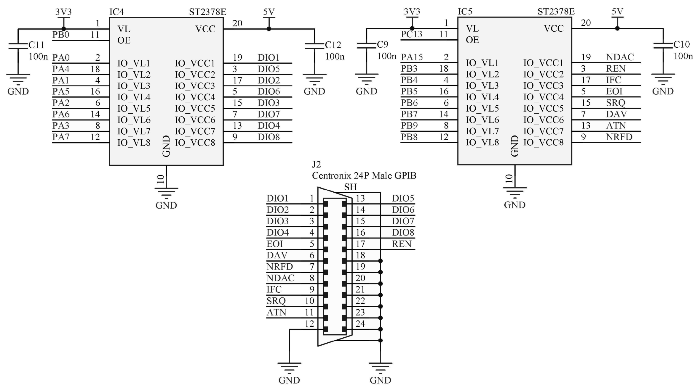

# USB-GPIB Adapter (HW & FW)
 A complete hardware and firmware design of a custom USB-GPIB adapter. This project was created as a part of a semestral work of a [Virtual Instrumentation course (B3M38VIN)](https://intranet.fel.cvut.cz/en/education/bk/predmety/46/82/p4682806.html) at the Czech Technical University.


## Repository Contents

* **Hardware folder** - Contains complete Altium Designer 6 PCB project, including PDF schematic and layout visualisations.
* **Firmware folder** - Contains complete Keil uVision project with the firmware for the STM32F103C6T6 microcontroller.
* **Gerber ZIP file** - An archive containing generated production files for the PCB.

## Motivation

The General Purpose Interface Bus (GPIB) is one of the most widely used communication interfaces for laboratory measuring and testing instruments. It was developed in 1965 by Hewlett-Packard (which is why it is sometimes referred to as HP-IB) and was later adopted as the IEEE 488 standard in 1975, gradually evolving into the current IEEE 488.2 standard in 1992. It also defined the SCPI (Standard Commands for Programmable Instruments) command structures, which now form a single and universal set of commands for controlling all instruments connected to this bus.

To connect the bus to the user's computer, however, a GPIB interface module is required, which is available for virtually all important types of computer buses, such as PCI or USB plug-in cards. However, both cables and GPIB interface modules (adapters) are very expensive, as they are used with expensive professional devices from companies such as Rhode & Schwartz, B&K Precision, Tektronix, HP, etc. They have no application in the mainstream consumer industry. To give a more realistic idea, Figs. 1 and 2 show commercial USB-GPIB adapters whose prices are in the tens of thousands of CZK. 

In the images below: [National Instruments GPIB-USB-HS adapter](https://cz.farnell.com/ni/778927-01/gpib-instrument-control-device/dp/3621284) (left) and [Keysight 82357B Interface USB-to-GPIB](https://cz.farnell.com/keysight-technologies/82357b/converter-interface-usb-to-gpib/dp/1425679) (right).

 

<p style="clear:both;">

For this reason, many open-source alternatives to commercial USB-GPIB adapters have already been developed that can be easily assembled and used without major problems with all laboratory instruments  with GPIB interfaces. This paper deals with the design of a similar adapter from commercially available components and is inspired by [this GitHub project](https://github.com/xyphro/UsbGpib).
</p>

## Basic Description of GPIB

GPIB is a parallel bus, i.e. each subsequent measuring instrument can be connected via a double-sided GPIB connector to the connector plugged into the previous instrument. In this way, up to 14 instruments can be connected together without a control counter (adapter). It supports a transfer rate of max. 1 MB/s. [[Tutorial Description of the Hewlett-Packard Interface Bus](http://www.bitsavers.org/pdf/hp/hpib/TutorialDescrOfHPIB.pdf)]


The standard GPIB connector is also labeled Centronics and uses 24 wires, as indicated in the image on right (taken from the [GPIB Tutorial](http://lmu.web.psi.ch/docu/manuals/software_manuals/GPIB/GPIB_tutorial.pdf)). Eight of the 24 wires are used for grounding and the remaining wires can be divided into 3 groups:
* **8 data wires** labeled DIO1 to DIO8. They are used for data and command transmission (depending on the state of the ATN wire). All commands and most data use the 7-bit ASCII/ISO set, therefore DIO8 can be used for parity.
* **3 handshaking wires** are used for asynchronous control of the byte transfer of individual messages between devices and guarantee error-free transmission. They are NRFD (not ready for data) controlled by the receiver, NDAC (not data accepted) also controlled by the receivers and DAV (data valid) controlled by the data senders.
* **5 control wires** for controlling the flow of information through the bus, namely:
    - ATN (attention) - the Controller sets to log 1 if a command is sent over the data wires.
    - IFC (interface clear) - uses the Controller to control activity on the bus.
    - REN (remote enable) - controlled by the Controller to provide remote control.
    - SRQ (service request) - can be used by any device for asynchronous controller service request.
    - EOI (end or indentify) - used by the Talker to indicate the end of a sent message, also used by the Controller.

The bus uses inverse TTL logic, i.e. if the state of the lines is log 1 (High), the corresponding voltage is less or equal 0.8	V. The inverse of the state log. 0 (Low) corresponds to a voltage greater or equal 2.0 V. To ensure high transmission speeds, conductor lengths and distances between devices are limited, a maximum cable length of 15 m is specified, all devices should use three-state logic (log 0, log 1 and Hi-Z high impedance state) and the capacitance of each conductor should be less or equal 50 pF.

The devices connected to the GPIB bus can be divided into 3 groups:
* **Talker**, which sends data to listeners (if prompted by the Controller).
* **Listener**, which receives data (if prompted by the Controller).
* **Controller**, which manages the data flow over the bus by means of commands sent to other connected devices. Only one active Controller can be connected to the bus at a time (Controller-in-Charge, CIC).

One device (e.g. a multimeter) can be both a Talker and a Listener. The USB-GPIB adapter is the bus Controller.

### Handshaking Protocol
In the original version of the 488.1 standard, it was necessary for each Listener to set the NRFD to log. 0, then the Talker set DAV to log 1 to indicate to the Listener that data was available, and finally the Listener set NDAC to log. 0 after receiving a byte of data, as in the left figure below (taken from the [GPIB Tutorial](http://lmu.web.psi.ch/docu/manuals/software_manuals/GPIB/GPIB_tutorial.pdf)). This caused a time delay of T1 before the whole process could be repeated and another byte of data could be sent.

 

<p style="clear:both;">

To accelerate data transfer (up to 8 MB/s) over the GPIB bus, National Instruments developed the High-Speed GPIB Handshake Protocol called HS488. In this case, the Talker first creates a pulse (log 0) on the NRFD wire (after the controller addresses all listeners) to indicate that it can use HS488. Then the Talker moves the first byte to the data wires, waits the preset time, and sets DAV to log 1. Then it waits again, sets DAV to log. 0 and moves the next byte to the data wires, as in the right figure above (taken from the [GPIB Tutorial](http://lmu.web.psi.ch/docu/manuals/software_manuals/GPIB/GPIB_tutorial.pdf)). The Listener leaves the NDAC in log. 1 and must be able to receive single bytes at the preset delays. The Listener can pause the byte transmission by setting the NDAC to log. 0. If the Listener does not support HS488 and wants to use the normal handshake protocol, it creates a pulse log. 0 on the NRFD line.
</p>

Due to the hardware nature of this project, I will not describe further here the control commands and sequences of the cont- roler, protocols (composed of multiple control sequences), the SCPI language, or other software aspects of the GPIB bus.

## Adapter Hardware Design

[The aforementioned GitHub project](https://github.com/xyphro/UsbGpib) uses the [ATMega32U4 microcontroller from Microchip](https://www.microchip.com/content/dam/mchp/documents/OTH/ProductDocuments/DataSheets/Atmel-7766-8-bit-AVR-ATmega16U4-32U4_Datasheet.pdf). This 8-bit microprocessor offers 32 kB of FLASH memory and 2.5 kB of SRAM memory and is based on the AVR architecture. It contains a USB peripheral, an internal 8 MHz oscillator and a maximum core operating frequency of 16 MHz (16 MIPS). The advantage is the power supply voltage of a 5 V and the corresponding voltage tolerance of the GPIO pins in the input and output configuration.

For my design I chose the [STM32F103C6T6 microprocessor from STMicroelectronics](https://www.st.com/resource/en/datasheet/stm32f103c6.pdf). It is a 32-bit microprocessor also with 32 kB of FLASH memory and 10 kB of SRAM memory, built on ARM architecture with Cortex-M3 core. It also offers a USB peripheral and an internal 8 MHz RC oscillator that can be used with an integrated PLL to obtain a maximum operating frequency of 72 MHz. However, it must be powered from 3.3 V and most GPIOs are 5 V tolerant (denoted FT) in the input configuration only. I selected it for the easy soldering of its LQFP48 package.

### USB Connector

For connecting USB peripherals, I chose a USB 2.0 B female connector, which is standard for USB endpoint devices. To provide ESD protection, a [USBLC6-2 component from STMicroelectronics](http://www.st.com/resource/en/datasheet/usblc6-2.pdf) is added. The wiring diagram is shown below.

<div style="text-align:center"></div>

The USB_DM and USB_DP lines are connected directly to the microprocessor. The USB_EN line with a 1.5kOhm pull-up resistor on the USB D+ line is used to trigger enumeration as a Full-Speed USB Device (according to the USB FS specification), since STM32 microprocessors do not internally contain this resistor.

To be able to use GPIB socket or plug and thus to fit components from both sides (the socket pins are axially inverted to the plug pins), I made the PCB design axially symmetrical in respect to the placement of THT components. Because if the USB connector is soldered from the other side, the +5V contact is then swapped with GND, similarly D- with D+, so shorting jumpers SB1 to SB8 are added to resolve this problem. These jumpers (i.e. odd or even) should be closed on the side of the PCB where the USB connector will be mounted.

### Power Circuit

To obtain 3.3 V from 5 V (USB) I chose a linear regulator with output current up to 300 mA, low dropout, minimum quiescent current and fixed output voltage, [LDK130 from STMicroelectronics](https://www.st.com/resource/en/datasheet/ldk130.pdf). Blocking capacitors of 100 nF are added at all power supply pins of the ICs in the circuit. The schematic is shown in figure below.

<div style="text-align:center"></div>


### STM32 Microcontroller

Since the internal RC oscillator is be used, pins PD0 and PD1 remain unconnected. Pull-up resistor R2 keeps log. 1 on the reset pin of the microcontroller and button SW1 is used to ground and reset it, capacitor C8 is placed here to filter out mechanical oscillations of the button. Pull-down resistor R3 on the BOOT0 pin is used to initially load the program from the microprocessor's FLASH memory.

STM32 processors are programmed via the SWD interface and the ST-Link programmer, which consists of the SWDCLK and SWDIO pins in addition to the reset pin, power and ground. These 5 wires are routed through the J3 connector in the same order as they are found, for example, on Nucleo boards. The wiring of this part is shown below.

<div style="text-align:center"></div>

### RGB Indication LED

For the indication of the adapter's status I chose an RGB LED with a common anode with a package size of 5 mm.

Individual internal LEDs are switched via MOSFET N-channel transistors of type BSS138. An inverter consisting of transistor Q1 and resistor R7 ensures that the red component of the RGB LED is lit immediately after power is connected, and can be turned off using log. 1 on pin PB13. The schematic is shown below.

<div style="text-align:center"></div>

### GPIB Connector

The microprocessor GPIOs PA0 to PA7 are assigned to the data wires D1 to D8 of the GPIB bus. The remaining bus wires are assigned to GPIOs PB3 to PB9 and PA15. To add 5V tolerance to the microprocessor outputs and ESD protection to the bus wires, two [ST2378E 8-bit level-translators](https://www.st.com/resource/en/datasheet/cd00003335.pdf) (3.3V to 5V logic level converters) from STMicroelectronics are used. They are designed for bidirectional asynchronous data transfers up to 13 Mbps. The GPIOs of the microcontroller PB0 and PC13 are connected to the OE (Output Enable) pins, which are used to enable/disable these converters.

The bus wires are shuffled on the pins of these ICs to interface the pins of the microprocessor package while minimising the number of necessary vias. To ensure similar path impedance, the first IC is designated for the data lines and the second IC for the control lines. The schematic is shown below.

<div style="text-align:center"></div>

### Layout Visualisation

Top and bottom views of the layout are shown below. The PCB size is approximately 71.1x55.9 mm. If an adapter case is designed (e.g. for 3D printing), 3.2mm mounting holes in the corners can be used for its attachment. THT components mounted on the top side or on the bottom side of the PCB should always fit into a printed case the same way for both cases.


 

<p style="clear:both;">
</p>

### Bill of Material (BOM)

| **IDs**     | **Pcs** | **Value/Type**                                | **Description**              | **Package** |
|-------------|---------|-----------------------------------------------|------------------------------|-------------|
| C1,C3       | 2       | 1u                                            | Ceramic capacitor            | 0603        |
| C2,C4-C12   | 10      | 100n                                          | Ceramic capacitor            | 0603        |
| IC1         | 1       | USBLC6-2SC6                                   | ESD protection for USB       | SOT23-6     |
| IC2         | 1       | LDK130M33R                                    | LDO regulator 3.3V/300mA     | SOT23-5     |
| IC3         | 1       | STM32F103C6T6                                 | 32-bit MCU                   | LQFP-48     |
| IC4,IC5     | 2       | ST2378ETTR                                    | Voltage-level translator     | TSSOP-20    |
| J1          | 1       | WE 61400416121                                | USB 2.0 B female connector   | 4-pin       |
| J2 (male)   | 1       | NorComp 112-024-113R001                       | GPIB Centronics plug         | 24-pin      |
| J2 (female) | 1       | NorComp 112-024-213R001<br>CONNFLY DS1079-F240BS | GPIB Centornics socket       | 24-pin      |
| J3          | 1       | RM2.54mm                                      | Pin header                   | 5-pin       |
| LED1        | 1       | RGB                                           | Common anode LED             | 5mm         |
| SW1         | 1       | KLS TS6601-13.5-180                           | Microswith (ON)-OFF          | 6x6mm       |
| R1          | 1       | 1k5                                           | Resistor                     | 0603        |
| R2,R3,R7-R9 | 5       | 10k                                           | Resistor                     | 0603        |
| R4-R6       | 3       | 110R                                          | Resistor                     | 0603        |
| Q1-Q4       | 4       | BSS138                                        | N-Channel logic-level MOSFET | SOT23-3     |


## Firmware Description

### USB Test and Measurement Class (USBTMC)

The documentation of the USBTMC class and the USB endpoints and packets used is available [in an archive at usb.org](http://www.usb.org/sites/default/files/USBTMC_1_006a.zip), including the documentation of the USBTMC subclass USB488. The details of data transfer from USB to GPIB bus, supported commands and behaviour according to the official [IEEE 488.1](https://doi.org/10.1109/ieeestd.1988.81527) and [IEEE 488.2](https://doi.org/10.1109/ieeestd.1992.114468) standards are described in the following text.

Endpoints are basically sections of the memory of the connected USB device (e.g. USB-GPIB adapter), which are accessed by the host (e.g. user PC) and written to/read from, i.e. they are USB protocol communication channels. According to the documentation, every USB device of the TMC class implements these endpoints:
* Control endpoint (mandatory) - used to control the device by the host, data is written and read according to the USB 2.0 protocol documentation, its serial number is always 0x00.
* Bulk-OUT (mandatory) - for writing data to the device (i.e. Host-To-Device).
* Bulk-IN (mandatory) - for reading data from the device (i.e. Device-To-Host).
* Interrupt-IN (optional) - uses the device to notify the host of events (for subclass USB488), e.g. when an SRQ is detected on the GPIB bus.

The messages defined by the TMC class that are written and read by the host from endpoints on the device have a fixed structure that typically consists of the message type (MsgID, 0 to 255), an incremented transfer identifier (bTag and bTagInverse, 0 to 255), and the content according to the message type.

An example of a message type (without a defined device response) is `DEV_DEP_MSG_OUT`, which is written by the host to the Bulk-OUT endpoint and contains the number of bytes to be transmitted and the message (or part of the message). In contrast, the `REQUEST_DEV_DEP_MSG_IN` message type is used by the host when it wants to request the device to send a response, i.e. to write a `DEV_DEP_MSG_IN` message to the Bulk-IN endpoint. These are all 3 types of device dependent messages, similarly 3 types of vendor dependent messages are defined. For Bulk endpoints, these are all message types defined by the TMC class and are used to transfer commands/measured data (in the same format as on the GPIB bus).

In addition, the USB488 subclass specifies the TRIGGER message type (to Bulk-OUT, no defined response) and is used for synchronization. I.e. on receipt, the adapter generates a GET command on the GPIB bus. This message corresponds to sending the "*TRG" command with a message of type `DEV_DEP_MSG_OUT`.

The TMC documentation also describes the methods of splitting, interrupting and blocking transmissions, then requirements for repeating certain messages, packet formats with settings and how the capabilities of the connected device (Setup, Capabilities) are written to the Control endpoint, the use of the Interrupt-IN endpoint etc.

### Examples of TMC communication

An example taken from the [USB Device Test and Measurement Class Specification](http://www.usb.org/sites/default/files/USBTMC_1_006a.zip) is passing the identification command `"*IDN?"` to a connected USB device (e.g. USB-to-GPIB adapter). In this case, the host writes a message of type DEV_DEP_MSG_OUT with the contents shown in the below figure to the Bulk-OUT endpoint.

<div style="text-align:center"></div>

Then the host writes into the Bulk-OUT register another message (another transfer, that is why the bTag is 0x02) of the `REQUEST_DEV_DEP_MSG_IN` type - requesting a response from the device (adapter), with the content shown in the figure below.

<div style="text-align:center"></div>

Eventually, the device (adapter) responds by writing into the Bulk-IN register a message of the `DEV_DEP_MSG_IN` type containing the identification of the measuring device (the bTag value is still 0x02) e.g. `"XYZCO,246B,S-0123-02,0\n"` (according to the format in the [IEEE Std 488.2-1992](https://doi.org/10.1109/ieeestd.1992.114468), ch. 10.14), with the content shown in the figure below.

<div style="text-align:center"></div>

Thanks to the fact that the content of the TMC messages corresponds to the content of the communication over the GPIB bus, the adapter is very simple in terms of firmware. The USB-GPIB adapter only interprets the incoming TMC messages by controlling the bus wires appropriately using GPIO, similarly reading the data from the bus and passing it to the host (user PC). The TMC class standard is also fully compatible with common software designed for GPIB control, such as NI-VISA or LabView.

To use the USBTMC class in this project it was advisable to use the existing open-source library [TinyUSB](https://github.com/hathach/tinyusb) or [LIBUSB](https://github.com/dmitrystu/libusb_stm32), as both already contain implementations of this class, including the necessary definitions and USB descriptors, and also support STM32 microprocessors.


### GPIO Control of the GPIB Bus

The procedures for controlling the GPIB bus wires using GPIO were taken from the aforementioned GitHub project. LOW states mean log. 1 (True), HIGH states mean log. 0 (False), i.e. according to the voltage on the bus wires. I only list here the 2 most important procedures implementing the handshaking protocol, namely for sending a byte over the bus and reading a byte from the bus.

Then it is possible to use the commands to e.g. test the listener addresses (setting the active listener by the LAG command on each address in turn and test the reaction to the ATN change to HIGH by waiting for the NDAC change to LOW) and thus find all the measurement devices connected to the GPIB bus (if there is no listener on the given address, the NDAC remains HIGH).

#### Pseudocode: Sending a byte over the bus

```
DAV, NRFD, NDAC ← HIGH (default)
if COMMAND then
    ATN ← LOW
else
    ATN ← HIGH
end if
DIO1.. 8 ← BYTE
Wait until NRFD ← HIGH (ready for data)
DAV ← LOW (data available)
Wait until NDAC ← HIGH (data accepted)
DAV ← HIGH (data not available)
Release DIO1... 8
ATN ← HIGH (default)
```

#### Pseudocode: Reading a byte from the bus

```
NDAC ← LOW (data not accepted)
NRFD ← HIGH (ready for data)
Wait until DAV ← LOW (data available)
NRFD ← LOW (not ready for data)
BYTE ← DIO1.. 8
NDAC ← HIGH (data accepted)
Wait until DAV ← HIGH (data not available)
if EOI is LOW then
    Transfer terminated (last byte)
end if
```

## Todo List

* Finish the USB TMC class implementation in the FW project (as a USB composite device). Currently, only the USB CDC implementation works.

